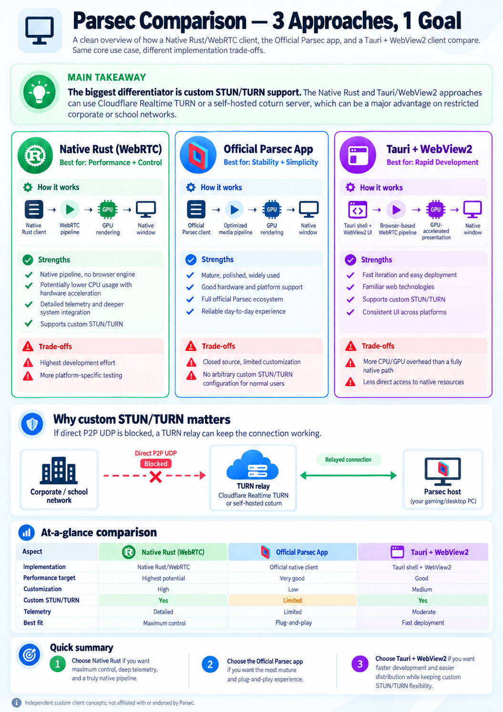

# ParsecWebTurn

**Connect to your Parsec computer with a lightweight, portable client.**

ParsecWebTurn is an independent community client for Parsec, built with Rust.
The goal is simple: smooth remote video and sound, more control over
how you connect, and support for more devices over time.

The native client runs without Edge or WebView2. It keeps Parsec's web-client core
and familiar interface, while Rust handles the connection, video, audio and input.
On Windows, you launch a single **ParsecWebTurn.exe**.

> **You are viewing the native client's development branch.** It already supports
> real remote sessions, but some features are still being built. The `main` branch
> and current stable release use the earlier Tauri/WebView2 client.
> ParsecWebTurn is not the official Parsec app and is not affiliated with Parsec or Unity.

This branch contains only the native client. The earlier WebView2 source remains
available on `main` and in the [v0.7.0 source](https://github.com/vampywiz17/ParsecWebTurn/tree/v0.7.0).

## Why this project?

- **A portable client:** one executable, with no browser runtime to install.
- **GPU-focused video:** use the graphics card for the video pipeline and aim to
  keep CPU work low.
- **More connection options:** bring custom STUN/TURN servers to the native client,
  building on the earlier WebView2 version.
- **More platforms:** work toward Linux, then explore Android and Android TV.
- **Better visibility:** plan useful connection and playback statistics from the
  native client itself.

These are development goals, not a promise of lower resource usage than every
other client. Performance depends on your computer, graphics driver and stream.

## What can I use today?

The native Windows development build currently supports:

- Signing in, browsing your computers and connecting to a Parsec host.
- H.264 video with a D3D11-based GPU video pipeline.
- Opus audio, keyboard and mouse input.
- The familiar Parsec stream overlay, including its relative-mouse option.
- Remembering your sign-in and Parsec preferences between launches.
- Graceful disconnect from the overlay and when closing the app.

Your remote computer still needs the regular Parsec host. Not every setting in
the original interface has been integrated or tested yet.

## Getting started

1. Download **ParsecWebTurn-dev-win64** from a successful
   [native Windows build](https://github.com/vampywiz17/ParsecWebTurn/actions/workflows/native-wasm-prototype.yml?query=branch%3Adev).
   GitHub may require you to sign in to download build artifacts.
2. Unzip the package and run **ParsecWebTurn.exe**.
3. Sign in to your Parsec account and select your computer.

You need Windows x64 and compatible graphics drivers with D3D11 and OpenGL support.
There is no installer and the app does not require administrator rights to run.
Windows may separately ask about firewall access; network rules can affect whether
a connection succeeds.

**Shortcuts:** F11 switches fullscreen on or off. F8 shows or hides the video layer
if you need to reach the interface underneath. Use the Parsec overlay for stream
controls, volume and relative mouse mode.

Sign-in and preferences are saved under `%LOCALAPPDATA%\ParsecWebTurn\Native`,
encrypted for your Windows user. Replacing the EXE keeps these settings. When
moving from the older WebView2 client, sign in once in the native app; your old
settings and browser profile are left in place.

For the previous WebView2-based stable client, see
[Releases](https://github.com/vampywiz17/ParsecWebTurn/releases).

## Milestones and roadmap

**Available** means implemented in the native dev build. **Planned** means it is
not available there yet. **Exploring** means a possible future direction, with no
delivery commitment. There are no fixed release dates for these milestones.

| Milestone | Status | What it means for you |
| --- | --- | --- |
| Native Rust WebRTC client | Available | Connect to a Parsec host without WebView2, using the existing Parsec WASM core. |
| Native Windows video, audio and controls | Available | D3D11 video output, H.264 playback, Opus sound, keyboard, mouse and the Parsec overlay. |
| Single executable and saved settings | Available | Run the portable EXE; keep your sign-in and preferences after restarting. |
| STUN connectivity | Available, with a fixed server | The native client currently uses Parsec's default STUN server for direct connections. |
| Custom STUN and TURN relay support | Planned for native; available in the earlier WebView2 client | Choose Cloudflare or your own compatible server, such as coturn or eturnal. Retain compatibility with the old STUN/TURN configuration file. |
| More audio formats and menu integration | Planned | Support additional audio choices and review which Parsec settings need native integration. |
| Native connection and playback statistics | Planned for native; available in the earlier WebView2 client | Bring the earlier client's statistics to the native app, including connection quality, playback and resource usage. |
| Vulkan rendering backend | Planned | Add another GPU rendering option alongside D3D11 and build toward Linux support. |
| D3D12 rendering backend | Exploring | Investigate an additional native GPU rendering option on Windows. |
| Linux client, distributed as Flatpak | Planned | Make the native client available on Linux with straightforward installation. |
| Native Android and Android TV clients | Exploring | Investigate a mobile/TV client using the shared Rust foundation and a Vulkan rendering path. |

Vulkan is one part of bringing the client to other platforms. Linux and Android
also need their own video decoding, audio, window and input integration; adding
Vulkan alone will not make the Windows client run there.

## STUN, TURN and restricted networks

**STUN helps find a direct connection. TURN forwards traffic when a direct route
is unavailable.** This can be useful on restrictive networks or computers where
installing a VPN is not possible.

Custom STUN/TURN is already supported by the earlier Tauri/WebView2 client.
**The native dev client currently has no configurable TURN relay support and does
not apply saved WebView2 server settings yet.** Bringing those options to the
native client is a planned milestone.

The goal is to offer direct connections and user-chosen relays without requiring
a VPN or Parsec's paid relay offering. Your relay provider may still charge for
traffic. A relay also needs to be reachable and permitted by the network; no
client can guarantee access through every company or school firewall.

## Three approaches, one goal

The illustration below compares the native Rust direction, the official Parsec
app and the earlier Tauri/WebView2 approach.

> **Concept illustration:** it includes planned features and potential benefits.
> In particular, custom TURN support, Vulkan, broader platform support and a native
> statistics panel are not all present in this dev build. Use the roadmap above
> for the current status. The image is not a benchmark or an up-to-date reference
> for the official app's features or pricing.

[Open the full-size comparison](assets/native-client-comparison.png).

## Help improve the client

Found a problem? [Open an issue](https://github.com/vampywiz17/ParsecWebTurn/issues)
with your app version, Windows version, graphics card and the steps to reproduce
it. Say whether you are connecting directly, through a VPN or using the earlier
WebView2 client's relay options. Never include passwords, session tokens or TURN
credentials in a public report.

For implementation, build instructions and host-certificate compatibility details,
see the [technical guide](docs/NATIVE_TECHNICAL.md). The
[configuration compatibility notes](docs/NATIVE_CONFIG_COMPATIBILITY.md) describe
the planned migration of old STUN/TURN settings, and the
[validation history](docs/NATIVE_DEV_0_8.md) records what has been tested.

Parsec and its client core belong to their respective owners. ParsecWebTurn is an
independent project; included third-party license notices must accompany binary
redistribution.
