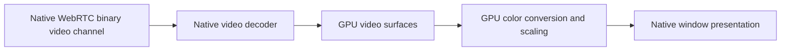

# Native prototype: rendering and telemetry requirements

User requirements, 2026-10-08. Applies to the isolated Rust/WASM prototype;
this document does not change the production Tauri application.

## Primary goal

Use **hardware GPU rendering with the least practical CPU work**. Optimize the
actual decode-to-display path, not the name or version of the graphics API.
No performance gain is claimed until measured with a real stream.

The planned video path is:

M1 verifies the native data-channel transport separately and initializes the WASM
backend. It does not yet integrate a live Parsec session, decoder or renderer.
The WASM/Matoya UI graphics bridge is a separate surface from remote-video
presentation; both need a real native implementation.

## Renderer and decoder decisions

- Keep decoder and renderer interfaces separate. Report their actual selected
  implementations independently; a D3D11 decoder is not proof of D3D11 presentation.
- First investigate a documented Windows Media Foundation/D3D11 path with a
  shared D3D11 device and DXGI video surfaces. Confirm hardware decoding for the
  actual codec/profile and expose the selected GPU adapter.
- Keep color conversion, scaling and compositing on the GPU. Avoid default
  per-frame GPU readback, CPU pixel conversion and intermediate CPU image copies.
  Reuse textures and use bounded queues instead of growing frame history.
- GPU-to-GPU copies may be necessary for decoder texture binding or synchronization.
  Distinguish these from CPU readback; claim direct texture reuse only after verifying it.
- Add D3D12/Vulkan renderer choices only with implemented, tested native backends.
  List the choices the build and current adapter actually support. API selection
  alone does not prove hardware decode, lower CPU load or a better driver path.
- Do not silently select a software GPU adapter or hide software decoding behind
  a generic "hardware" label. Report unavailable capabilities/failures clearly.
- Use event-driven waits and bounded work queues, not CPU busy polling. Device
  loss, frame ownership, decoder backpressure and clean shutdown need explicit handling.

This is an implementation direction, not a guarantee that every GPU/driver or
codec supports a path without CPU pixel copies. The retained Parsec core and host
must still provide a compatible encoded stream.

## Native telemetry

Source statistics from our owned pipeline, public native WebRTC APIs and
documented Windows APIs, rather than browser internals.

| Value | Intended source / meaning |
| --- | --- |
| Renderer, adapter | Actual created graphics device and hardware/software adapter |
| Decoder, hardware decode | Actual selected decoder and confirmed device-backed output |
| Codec, dimensions, audio format | Detected stream/decoder configuration; retain while silent |
| Decoded FPS | Decoder output count over a measured interval |
| Presented FPS | Frames actually presented by the renderer, separate from decoded FPS |
| Decode/render duration | Timings from our pipeline, labeled by stage |
| Queue drops | Our dropped frames, not a claimed network loss count |
| RTT, ICE route, TURN usage | Selected active native WebRTC transport with sufficient evidence |
| Traffic bitrate | Measured bytes over time, labeled as actual traffic |
| Configured encoder bitrate | Only if the remote protocol explicitly provides it |
| CPU/GPU load | Our native application processes and GPU work via Windows APIs |
| Network loss | Only available transport counters with clear semantics |

Parsec uses encoded media over SCTP data channels, not ordinary RTP video/audio.
Do not invent RTP packet-loss statistics or equate retransmissions/queue drops
with lost video packets. Keep unknown telemetry unknown. There will be no
WebView2 GPU process in this native design; attribute GPU usage to the owned app.

## Validation before calling the renderer milestone complete

Show real decoded frames in a native window and verify device-backed rendering.
Measure the intended 1080p/60 stream's presented FPS, frame timings, CPU/GPU load
and memory. Check sustained playback, resize/fullscreen, reconnection and device
cleanup. Describe the hardware/driver and actual decode/render paths alongside
results, without promising an unmeasured CPU target.

References:

- [Microsoft: D3D11 decoding in Media Foundation](https://learn.microsoft.com/en-us/windows/win32/medfound/supporting-direct3d-11-video-decoding-in-media-foundation)
- [Microsoft: DXGI device manager](https://learn.microsoft.com/en-us/windows/win32/api/mfobjects/nn-mfobjects-imfdxgidevicemanager)
- [Microsoft: Direct3D 12 and D3D11 interoperability](https://learn.microsoft.com/en-us/windows/win32/direct3d12/what-is-directx-12-)
- [W3C: WebRTC data channels](https://www.w3.org/TR/webrtc/#rtcdatachannel)
